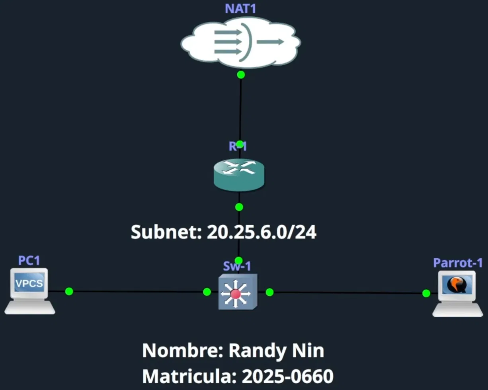

# MAC-FLOODING

> **Autor:** Randy Nin **Laboratorio de Seguridad de Redes | GNS3**

Script de Python que realiza un ataque de desbordamiento de tabla CAM (MAC Flooding) contra switches Cisco. Genera y envía tramas Ethernet con direcciones MAC de origen completamente aleatorias de forma masiva, forzando al switch a registrar cada trama como un nuevo dispositivo hasta saturar su capacidad de aprendizaje dinámico.

---

## Contenido del repositorio

```
MAC-FLOODING/
├── mac_flooding.py
├── Documentación Tecnica Profesional MAC-FLOODING (Randy Nin -- 2025-0660).pdf
└── README.md
```

---

## Documentación técnica

La documentación técnica completa de este laboratorio está disponible en:

**[Documentación Tecnica Profesional MAC-FLOODING (Randy Nin -- 2025-0660).pdf](Documentación%20Tecnica%20Profesional%20MAC-FLOODING%20(Randy%20Nin%20--%202025-0660).pdf)**

Incluye contexto técnico de la tabla CAM y su vulnerabilidad, topología y configuración del entorno, análisis técnico completo del script, evidencia del desbordamiento con capturas de pantalla y contramedidas con Port Security.

---

## Requisitos

**Sistema:** ParrotSec OS, Kali Linux o cualquier distribución Linux con soporte para envío de paquetes raw a nivel de Capa 2.

**Python:** 3.x con permisos de superusuario (`sudo`).

**Dependencias externas:**

|Librería|Instalación|
|:--|:--|
|`scapy`|`pip install scapy`|
|`termcolor`|`pip install termcolor`|
|`pwntools`|`pip install pwntools`|

**Instalación rápida:**

```bash
pip install scapy termcolor pwntools
```

---

## Uso

```bash
sudo python3 mac_flooding.py -i <interfaz> -c <cantidad> -d <delay>
```

**Parámetros:**

|Flag|Descripción|Default|
|:--|:--|:-:|
|`-i` / `--interface`|Interfaz de red desde la que se inyectan las tramas|Requerido|
|`-c` / `--count`|Cantidad de paquetes a enviar. `0` activa el modo infinito|`0`|
|`-d` / `--delay`|Tiempo en segundos entre cada trama. `0.0` elimina cualquier pausa|`0.001`|

**Ejemplo usado en el laboratorio:**

```bash
sudo python3 mac_flooding.py -i ens4 -c 80000000 -d 0.00
```

Presionar `Ctrl+C` para detener el ataque de forma limpia.

---

## Cómo funciona

Por cada iteración del loop, el script genera una trama Ethernet con MAC de origen aleatoria en el rango `02:xx:xx:xx:xx:xx` y la envía hacia la dirección de broadcast:

```
Ethernet
  ├── src : 02:XX:XX:XX:XX:XX  (aleatoria por iteración)
  ├── dst : ff:ff:ff:ff:ff:ff  (broadcast)
  └── Payload: IP / ICMP (relleno sin relevancia funcional)
```

El switch recibe cada trama, lee la MAC de origen y la registra como un nuevo dispositivo dinámico en su tabla CAM. Al no existir ningún mecanismo de autenticación ni control de frecuencia de aprendizaje, el proceso se repite indefinidamente hasta agotar el espacio disponible. El indicador de `pwntools` actualiza el conteo en pantalla cada 100 paquetes.

---

## Entorno de laboratorio



|Dispositivo|Rol|Interfaz en Sw-1|IP|MAC|
|:--|:--|:--|:--|:--|
|R-1|Gateway / DHCP / NAT|Gi1/0|20.25.6.60/24|0c:16:94:84:00:00|
|Sw-1|Switch víctima|N/A|N/A|N/A|
|PC1|Host legítimo|N/A|20.25.6.61/24|00:50:79:66:68:00|
|Parrot-1|Atacante|Gi0/0|20.25.6.64/24|0c:db:b8:ad:00:00|

> El ataque opera exclusivamente en Capa 2. No se requiere configuración IP activa en el atacante para ejecutarlo.

---

## Impacto observado

- Tabla CAM escaló de 2 entradas legítimas a 2987 entradas falsas en cuestión de segundos
- El espacio disponible (~70 millones de entradas) ilustra que un ataque sostenido puede llenar la tabla completa
- Al saturarse, el switch deja de reenviar selectivamente y comienza a inundar el tráfico por todos los puertos, exponiendo las comunicaciones de cualquier dispositivo conectado

---

## Mitigación

Port Security configurada en el puerto de acceso del atacante:

```
Switch(config)# interface GigabitEthernet0/0
Switch(config-if)# switchport mode access
Switch(config-if)# switchport port-security
Switch(config-if)# switchport port-security maximum 1
Switch(config-if)# switchport port-security mac-address sticky
Switch(config-if)# switchport port-security violation shutdown
```

Al detectar una segunda MAC en el puerto, el switch registra la violación en el log del sistema y coloca la interfaz en estado err-disable de forma automática e inmediata. Para rehabilitar el puerto tras una violación:

```
Switch(config)# interface GigabitEthernet0/0
Switch(config-if)# shutdown
Switch(config-if)# no shutdown
```

---

## Video demostrativo

**Enlace:** [https://www.youtube.com/watch?v=e1KalNX6-uY&list=PLxMefEiS_P6q8N0wKhpkK-Jj_UT1Bmuzp](https://www.youtube.com/watch?v=e1KalNX6-uY&list=PLxMefEiS_P6q8N0wKhpkK-Jj_UT1Bmuzp)

---

## Disclaimer

Este script fue desarrollado con fines exclusivamente académicos y educativos. Su uso está permitido únicamente en entornos propios o autorizados como GNS3, EVE-NG o laboratorios internos de prueba. El uso en redes de terceros sin autorización expresa constituye una violación legal.

---

_Randy Nin / Matrícula 2025-0660_

---
